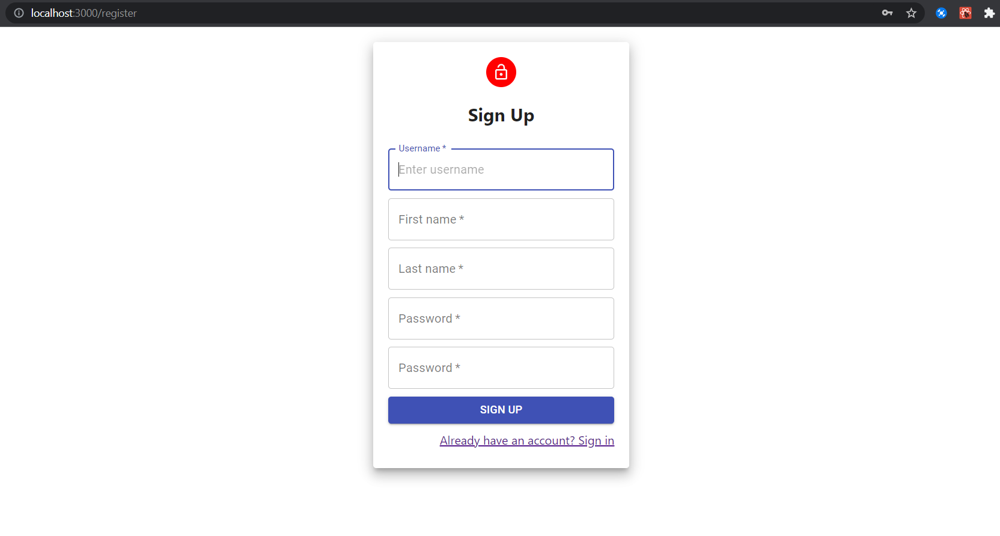

# Getting Started

This project was bootstrapped with [Create React App](https://github.com/facebook/create-react-app).

## How to start

In the project directory, you can run:

### `npm start`

Runs the app in the development mode.\
Open [http://localhost:3000](http://localhost:3000) to view it in the browser.

The page will reload if you make edits.\
You will also see any lint errors in the console.

### Details

This app is created using ReactJs which is a library of javascript used for
frontend development. The app includes all CRUD operations which makes it suitable for learning purpose. The backend of this app built using Django and it is uploaded
too on GitHub.

This is a beginner to intermediate level app in which following React concepts
are used:

    1. React Functions and Class based components
    2. React Hooks
    3. React Routers
    4. Material UI
    5. Props and State Management

### Images

Here are some images of different pages of frontend application

#### If you find any bug, Please resolve and make a pull request. Thanks.
